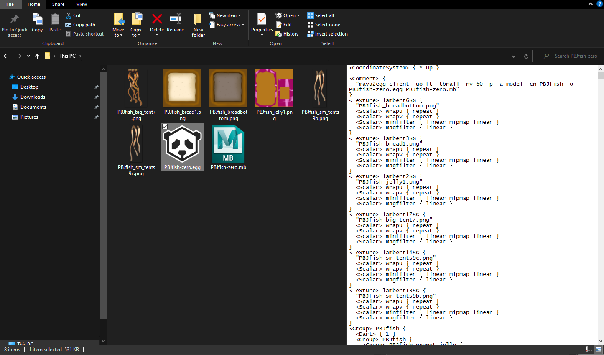

# Panda3D Windows Registry Add-ons

It can get a bit annoying opening a new command prompt each time you want to modify a Panda3D model (eg bam2egg), especially if you have tons of models to convert!

Simple operations shouldn't be time-consuming jobs. The registry keys provided expands what you can do with egg files to help cut down the time it takes to perform these simple tasks.

## Features

**Egg file extensions:**
- Support for previewing the contents of egg files in Windows Explorer's preview pane.
- Convert to Bamfile in context menu.

### Panda3D Context Menu Shortcuts

## Installation

1) Copy all of the Python files located in the ``scripts`` folder into a new directory (if desired). Keep note of this directory's path.
2) Launch ``SetEnvVariables.bat`` and enter your preferred Panda3D installation path & the new directory from step 1 when prompted.
    - This will create two environment variables under the user: ``PANDA_PATH_1`` and ``PANDA_REGISTRY_PATH_1``.
3) Open ``egg_extensions.reg`` and install the new keys. *You will need administrator privileges in order to apply these changes.*
6) If all works as intended, you should now be able to view these shortcuts when you right click on a bam/egg file! *(Does not require restarting your computer.)*

## Todo

- Bring back bam operations (flattening, bam2egg)

## Disclaimer

Modifying the registry can be *dangerous* if done incorrectly. Traditionally, guides will tell you to backup registries before installing new keys from the Internet. While it would be a bit redundant to backup your *entire* registry for preparing to install these keys, it is generally good practice to keep backups of your registry keys somewhere in case something ever goes wrong. It is also a great idea to export your ``.bam`` and ``.egg`` keys before doing any modifications, in case something does go wrong.

That being said, I am not responsible for anything if something ends up going wrong (which it shouldn't.) Use at your own risk.
